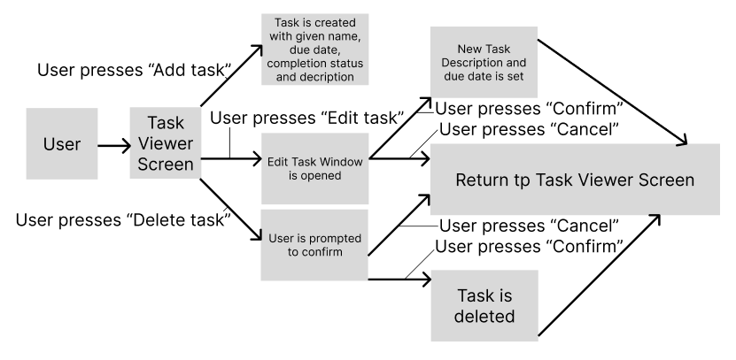

# U16A2

- [U16A2](#u16a2)
  - [Design](#design)
    - [Definition statement](#definition-statement)
      - [Data Structures](#data-structures)
      - [Control Structures](#control-structures)
    - [Algorithm designs](#algorithm-designs)
    - [Aesthetic design](#aesthetic-design)
    - [Design Review](#design-review)
  - [Analysis of the Provided Code](#analysis-of-the-provided-code)
    - [Namespaces and Dependencies](#namespaces-and-dependencies)
    - [Entry Point](#entry-point)
    - [CSV Reading](#csv-reading)
    - [CSV Writing](#csv-writing)
    - [Class Definitions](#class-definitions)
    - [User Feedback](#user-feedback)
      - [Viktor](#viktor)
      - [Armandas](#armandas)
      - [Devon](#devon)
  - [Test](#test)
    - [Test Plan](#test-plan)
    - [Test Results](#test-results)
  - [Review](#review)
    - [Review of requirements (To-Do List)](#review-of-requirements-to-do-list)
    - [Review of requirements (Indexing System)](#review-of-requirements-indexing-system)

## Design

### Definition statement

Program1: To-do list. Users must be able to create and delete tasks. Tasks should be able to be selected as 'complete' or otherwise (in-complete). Each item (task) should have a title, description, due date and completion status. Description and due date should be mutable, and others immutable. Users should be able to toggle whether all items (tasks) or only 'completed' items (tasks) are shown. It is required that it have a GUI, and implementing it as a native desktop app (using WPF) seems appropriate as I am more familiar with this process that using HTML/CSS for the presentation layer (using Blazor for example). This suggests users should have a 'view', 'add', 'edit' and delete option available to them- through separate features of the to-do list, clearly visible at the top of the list, above the headings (the list presented in a table seems appropriate).

Program2: Index system. The solution must read book details, and generate a unique index reference before writing a new CSV file. A class should be responsible for allocating serial numbers as well as an appropriate interface to allow alternative implementations. A strongly decomposed solution with a single class handling the interface should make this easy to accomplish. There is no need for the user to have direct access to the data of the books (from the original CSV file), and any GUI would be wasted. The solution must be able to efficiently read through the items it is given to ensure that books are not given 2 or more index numbers and stored multiple times in the output CSV file. Being able to add new content to the original file is not required, but may be very useful in ensuring indexing stays consistent as new books are added to the libraries' collection - though this may be solved by having the program not give new indexes to contents with an existing one (though this should be done carefully to avoid repeated indexes).

#### Data Structures

Data dictionary for both programs:

"./DataDic.xlsx"

#### Control Structures

Control structures control the flow of the program. Examples may include: iterative (while, for); selection (if, switch case), and jump (continue, break, function calls) statements.

Problem 1: To-do List. Iterative and selection statements will certainly be used in validating the inputs for adding new items to the to-do list. As the program will carry out many different functions, jump statements to ensure the correct section of the program is being executed will be needed. After editing or adding an item, the program will then have to update the GUI to display the new changes, for example. This will repeatedly happen for full functionality.

Problem 2: Index system. A form of iterative statement, such as a while or for loop (both equally valid) would be necessary for looping through the range of books- in order to give them valid index's (if applicable) and add them to the new CSV file. Selection statements (if and switch case) would be needed for validating the data and ensuring unique index's are given. I don't see any need for jump statements throughout this program.

### Algorithm designs

Class Diagrams have been created for both solutions. See inside the project folders (program1 and program2) for "ClassDiagramX.cd" where X is an integer.

A use-case diagram has been created for the To-Do List program. The index system program does not have a use-case diagram. This is because of the lack of any needed interactivity for the program. As long as the user puts the data file in the correct folder- the program will work without any user input.

### Aesthetic design

See: ./GUIdesign.pdf

### Design Review

| Name | Suggestion | Comments |
| --- | --- | --- |
| Armandas | You have not specified which CSV reader you are going to use, though you've clearly shown that you will in your data dictionary | I am going to use the CsvHelper CSV reader: [https://joshclose.github.io/CsvHelper/](<https://joshclose.github.io/CsvHelper/>) |
| Viktor | The Visual design for the GUI is very basic and looks ugly | The focus is on the features of the program. If time allows it though, themes could be used to quickly add a thematic look to the GUI without much effort |
| Charlie | A pseudocode algorithm could help in the development process of the index system program | Instead of creating pseudocode, it is much more efficient to simply program a basic version that does not meet all requirements, and refine it over time. In order to show this, I will provide ample comments on the program to document how it has changed over time from its first version |

Overall, the designs included aim to meet all the basic user requirements for both programs:

Program1: To-Do List

Users must be able to create tasks [/]
Users should be able to delete tasks [/]
Tasks should be able to be selected as 'complete' or otherwise (in-complete) [/]
Each item (task) should have a title, description, due date and completion status [/]
Description and due date should be mutable, and others immutable [/]
Users should be able to toggle whether all items (tasks) or only 'completed' items (tasks) are shown [/]
Has a GUI [/]

Program2: Index system

The solution must read book details [/]
Generate a unique index reference [/]
Writing a new CSV file [/]
Allocating unique serial numbers [/]
Decomposed solution [/]
No user access to the data of the books [/]
Books are given 1 index number and stored once in the output CSV file [/]

## Analysis of the Provided Code

### Namespaces and Dependencies

The program imports several namespaces: `System.Globalization`, `System.Reflection`, and `CsvHelper` to handle CSV file operations.
The code assumes that the required dependencies, specifically the `CsvHelper` package, are already installed.

### Entry Point

The `Main` method serves as the entry point for the program.
It begins by obtaining the path to the CSV file (`Data.csv`) using `Assembly.GetEntryAssembly().Location` and some string manipulations. The file is then copied to a new file named `Data2.csv`.
A `StreamReader` is created to read the original CSV file.

### CSV Reading

A `CsvReader` object is instantiated using the `StreamReader` and the `CultureInfo.InvariantCulture`.
A custom mapping class `BookMap` is registered with the `CsvReader` to map the fields of the CSV file to the properties of the `Book` class.
The records are obtained using `csv.GetRecords<Book>()`, which returns an `IEnumerable<Book>` representing the parsed records.
A `List<BookTwo>` called `newRecords` is created to store the modified records.
The CSV reader is used to iterate through each record using a `while` loop.
Inside the loop, a new `BookTwo` object is created, and its properties are assigned values from the original record (`Book`).
The `GetHashCode()` method is used to generate a hash code for each record, which is assigned to the `Hash` property of `BookTwo`.
The modified record is added to the `newRecords` list.
Console output statements are used to display the generated hash code and the properties of the modified record.

### CSV Writing

A `StreamWriter` is created to write to the new CSV file (`Data2.csv`).
A `CsvWriter` object is instantiated using the `StreamWriter` and the `CultureInfo.InvariantCulture`.
A custom mapping class `BookTwoMap` is registered with the `CsvWriter` to map the properties of `BookTwo` to the CSV file headers.
The header row is written using `csvTwo.WriteHeader<BookTwo>()`.
Inside a `foreach` loop, each `BookTwo` record from the `newRecords` list is written to the CSV using `csvTwo.WriteRecord(r)`.
Console output statements are used to display the count of records written to the new CSV file.

### Class Definitions

The program defines two classes (at the time of review): `Book` and `BookTwo`.
`Book` represents the original records read from the CSV file.
`BookTwo` extends `Book` and adds an additional property `Hash` to store the generated hash code.
Custom mapping classes `BookMap` and `BookTwoMap` define how the properties of these classes are mapped to CSV headers.

Overall, the code reads a CSV file, generates unique IDs using hash codes, and writes the modified records to a new CSV file.

### User Feedback

Feedback from given users has identified the following issues in the implementation:

#### Viktor

Suggestion: The `StreamReader` and such resources are not disposed of, meaning the file resources are not properly released.
My Comment: The `StreamReader` and `StreamWriter` should be disposed of properly using `using` blocks to ensure that the file resources are released.

#### Armandas

Suggestion: It seems that the code copies the original CSV file unnecessarily, as the new file is not used in the reading process.
My Comment: Oversight in the design process to ignore possible errors with file resources. Planned to implement, as so will simply do so now.

#### Devon

Suggestion: The `Name` and `Title` properties are duplicated in the `BookTwo` class. It's unnecessary to redefine these properties, as they are already inherited from the `Book` class.
My Comment: I will remove the redundant property declarations. Similarly, the `Place`, `Publisher`, and `Date` properties in the `BookTwo` class are also redundant and can be removed.

Please note that the suggested changes have been made to the code for improved clarity and consistency. They have also been made before the submission of the code as part of the given assignment (with explanations as comments where applicable) and so the original version may not always be viewable. I have tried to keep it consistent in ensuring the comments include this, however.

## Test

### Test Plan

| Task | Description | Status | Result | Notes |
| --- | --- | --- | --- | --- |
| Click buttons in program | Click the Add button to ensure that tasks are created when this is done | Incomplete | x | x |
| Check empty input | Leave the input field for a new task's name empty to test if it will create an empty named task | Incomplete | x | x |
| Click tick boxes | Click tick boxes to ensure they work to tick and untick for complete and incomplete tasks | Incomplete | x | x |

| Task | Description | Status | Result | Notes |
| --- | --- | --- | --- | --- |
| Check output file | Check the output file against the original file. The output file should add an ID columns, but display other information the same (one column to the right though) | Incomplete | x | x |
| Check for unique IDs | Check that IDs given are unique, and that copies of the same entry have the same ID, but are still placed in the output file | Incomplete | x | x |
| Check original file | Make sure the data is the same before and after running the program | Incomplete | x | x |

### Test Results

| Task | Description | Status | Result | Notes |
| --- | --- | --- | --- | --- |
| Click buttons in program | Click the Add button to ensure that tasks are created when this is done | Complete | Pass | NA |
| Check empty input | Leave the input field for a new task's name empty to test if it will create an empty named task | Complete | Fail | Creates empty tasks, this needs to be addressed |
| Click tick boxes | Click tick boxes to ensure they work to tick and untick for complete and incomplete tasks | Complete | Pass | NA |

| Task | Description | Status | Result | Notes |
| --- | --- | --- | --- | --- |
| Check output file | Check the output file against the original file. The output file should add an ID columns, but display other information the same (one column to the right though) | Complete | Pass | NA |
| Check for unique IDs | Check that IDs given are unique, and that copies of the same entry have the same ID, but are still placed in the output file | Complete | Pass | IDs will be different every time the program is run, so putting data as an input that already has an ID will override this data - this ensures new IDs from identical books are the same, however |
| Check original file | Make sure the data is the same before and after running the program | Complete | Pass | NA |

## Review

Review the extent to which the programs meet client requirements

### Review of requirements (To-Do List)

Users must be able to create tasks [/]
Users should be able to delete tasks [X]
Tasks should be able to be selected as 'complete' or otherwise (in-complete) [/]
Each item (task) should have a title, description, due date and completion status [X]
Description and due date should be mutable, and others immutable [X]
Users should be able to toggle whether all items (tasks) or only 'completed' items (tasks) are shown [X]
Has a GUI [/]

Users be able to delete tasks was not implemented in the program. The program also fails to implement a mutable description and due date (or one at all) and does not support filtering tasks. This was due to time constraints during the development of the program. This means that the first program only meets some of the requirements of the users.

There is an implemented GUI, and users can create tasks. It clearly shows the purpose of the program (with a clear title) and tasks can be easily selected as complete or in-complete vit a tick box. However, the GUI is very simple - even simpler than the original design. The ability to add tasks is not immediately obvious, and there is no indication as to where a user needs to type in order to give the task a name. It is also not shown whether ticked means complete or incomplete. Although users would infer ticked as complete most of the time, it still makes the user need to think about how to use the program.

### Review of requirements (Indexing System)

Program2: Index system

The solution must read book details [/]
Generate a unique index reference [/]
Writing a new CSV file. [/]
Allocating unique serial numbers [/]
Decomposed solution [/]
No user access to the data of the books [/]
Books are not given 1 index number and stored once in the output CSV file [/]

All of the user requirements are met for the index system program, however. The output is formatted in a desirable way, with indexes in the first column. It would be easy to add new columns to the original csv and support it in the code. The most problematic part of this being the lack of a recursive method to copy all properties from a Book to Book2 type, including their values. If this was implemented, the only change having to be made would be adding the mapping from properties to fields in the csv file - which is simple and easy. In addition, the code also includes many comments to help in the understanding of its functionality - which would help future programmers. It is however extremely confusing. If a user wouldn't know where to put the file, they wouldn't be able to find out. There includes no description of how to use the program in the program files (some sort of readme for the program). It will also output in different places depending on whether it's a project solution or it has been exported into an independent program.

Overall, this creates a confusing but functional program that is difficult to use- but technically meets the user's requirements.
