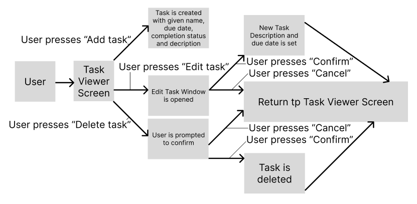

# U16A2

- [U16A2](#u16a2)
  - [Design](#design)
    - [Definition statement](#definition-statement)
      - [Data Structures](#data-structures)
      - [Control Structures](#control-structures)
    - [Algorithm designs](#algorithm-designs)
    - [Aesthetic design](#aesthetic-design)
    - [Design Review](#design-review)
  - [Analysis of the Provided Code (Indexing System)](#analysis-of-the-provided-code-indexing-system)
    - [Review of requirements (Indexing System)](#review-of-requirements-indexing-system)
    - [Namespaces and Dependencies](#namespaces-and-dependencies)
    - [Entry Point](#entry-point)
    - [CSV Reading](#csv-reading)
    - [CSV Writing](#csv-writing)
    - [Class Definitions](#class-definitions)
    - [User Feedback](#user-feedback)
      - [Viktor](#viktor)
      - [Armandas](#armandas)
      - [Devon](#devon)
  - [Analysis of the Provided Code (To-Do List)](#analysis-of-the-provided-code-to-do-list)
    - [Review of requirements (To-Do List)](#review-of-requirements-to-do-list)
  - [Test](#test)
    - [Test methods](#test-methods)
    - [Test Plan](#test-plan)
    - [Test Results](#test-results)
  - [Review](#review)
  - [Problem 1](#problem-1)
  - [Problem 2](#problem-2)

## Design

### Definition statement

Program1: To-do list. Users must be able to create and delete tasks. Tasks should be able to be selected as 'complete' or otherwise (in-complete). Each item (task) should have a title, description, due date and completion status. Description and due date should be mutable, and others immutable. Users should be able to toggle whether all items (tasks) or only 'completed' items (tasks) are shown. It is required that it have a GUI, and implementing it as a native desktop app (using WPF) seems appropriate as I am more familiar with this process that using HTML/CSS for the presentation layer (using Blazor for example). This suggests users should have a 'view', 'add', 'edit' and delete option available to them- through separate features of the to-do list, clearly visible at the top of the list, above the headings (the list presented in a table seems appropriate).

Program2: Index system. The solution must read book details, and generate a unique index reference before writing a new CSV file. A class should be responsible for allocating serial numbers as well as an appropriate interface to allow alternative implementations. A strongly decomposed solution with a single class handling the interface should make this easy to accomplish. There is no need for the user to have direct access to the data of the books (from the original CSV file), and any GUI would be wasted. The solution must be able to efficiently read through the items it is given to ensure that books are not given 2 or more index numbers and stored multiple times in the output CSV file. Being able to add new content to the original file is not required, but may be very useful in ensuring indexing stays consistent as new books are added to the libraries' collection - though this may be solved by having the program not give new indexes to contents with an existing one (though this should be done carefully to avoid repeated indexes).

#### Data Structures

Data dictionary for both programs:

[Data Dictionary](DataDic.xlsx)

#### Control Structures

Control structures control the flow of the program. Examples may include: iterative (while, for); selection (if, switch case), and jump (continue, break, function calls) statements.

Problem 1: To-do List. Iterative and selection statements will certainly be used in validating the inputs for adding new items to the to-do list. As the program will carry out many different functions, jump statements to ensure the correct section of the program is being executed will be needed. After editing or adding an item, the program will then have to update the GUI to display the new changes, for example. This will repeatedly happen for full functionality.

Problem 2: Index system. A form of iterative statement, such as a while or for loop (both equally valid) would be necessary for looping through the range of books- in order to give them valid index's (if applicable) and add them to the new CSV file. Selection statements (if and switch case) would be needed for validating the data and ensuring unique index's are given. I don't see any need for jump statements throughout this program.

### Algorithm designs

Class Diagrams have been created for both solutions. See inside the project folders (program1 and program2) for "ClassDiagramX.cd" where X is an integer.

A use-case diagram has been created for the To-Do List program. The index system program does not have a use-case diagram. This is because of the lack of any needed interactivity for the program. As long as the user puts the data file in the correct folder- the program will work without any user input.

### Aesthetic design

See: ./GUIdesign.pdf

### Design Review

16/B.P4

Review the plans for object-oriented programs with others to identify and inform refinements to produce a design  

There is no clear review of the design. The design is not implemented (ie code and design differ, but there is no explanation of why)

Exp. changes made, should naturally come as part of 'review'

| Name | Suggestion | Comments |
| --- | --- | --- |
| Armandas | You have not specified which CSV reader you are going to use, though you've clearly shown that you will in your data dictionary | I am going to use the CsvHelper CSV reader: [https://joshclose.github.io/CsvHelper/](<https://joshclose.github.io/CsvHelper/>) |
| Viktor | The Visual design for the GUI is very basic and looks ugly | The focus is on the features of the program. If time allows it though, themes could be used to quickly add a thematic look to the GUI without much effort |
| Charlie | A pseudocode algorithm could help in the development process of the index system program | Instead of creating pseudocode, it is much more efficient to simply program a basic version that does not meet all requirements, and refine it over time. In order to show this, I will provide ample comments on the program to document how it has changed over time from its first version |

## Analysis of the Provided Code (Indexing System)

### Review of requirements (Indexing System)

Program2: Index system. 

The solution must read book details []
Generate a unique index reference []
Writing a new CSV file. []
Allocating unique serial numbers []
Decomposed solution []
No user access to the data of the books []
The solution must be able to efficiently read through the items it is given to ensure that books are not given 2 or more index numbers and stored multiple times in the output CSV file. 
Being able to add new content to the original file is not required, but may be very useful in ensuring indexing stays consistent as new books are added to the libraries' collection - though this may be solved by having the program not give new indexes to contents with an existing one (though this should be done carefully to avoid repeated indexes).

### Namespaces and Dependencies

The program imports several namespaces: `System.Globalization`, `System.Reflection`, and `CsvHelper` to handle CSV file operations.
The code assumes that the required dependencies, specifically the `CsvHelper` package, are already installed.

### Entry Point

The `Main` method serves as the entry point for the program.
It begins by obtaining the path to the CSV file (`Data.csv`) using `Assembly.GetEntryAssembly().Location` and some string manipulations. The file is then copied to a new file named `Data2.csv`.
A `StreamReader` is created to read the original CSV file.

### CSV Reading

A `CsvReader` object is instantiated using the `StreamReader` and the `CultureInfo.InvariantCulture`.
A custom mapping class `BookMap` is registered with the `CsvReader` to map the fields of the CSV file to the properties of the `Book` class.
The records are obtained using `csv.GetRecords<Book>()`, which returns an `IEnumerable<Book>` representing the parsed records.
A `List<BookTwo>` called `newRecords` is created to store the modified records.
The CSV reader is used to iterate through each record using a `while` loop.
Inside the loop, a new `BookTwo` object is created, and its properties are assigned values from the original record (`Book`).
The `GetHashCode()` method is used to generate a hash code for each record, which is assigned to the `Hash` property of `BookTwo`.
The modified record is added to the `newRecords` list.
Console output statements are used to display the generated hash code and the properties of the modified record.

### CSV Writing

A `StreamWriter` is created to write to the new CSV file (`Data2.csv`).
A `CsvWriter` object is instantiated using the `StreamWriter` and the `CultureInfo.InvariantCulture`.
A custom mapping class `BookTwoMap` is registered with the `CsvWriter` to map the properties of `BookTwo` to the CSV file headers.
The header row is written using `csvTwo.WriteHeader<BookTwo>()`.
Inside a `foreach` loop, each `BookTwo` record from the `newRecords` list is written to the CSV using `csvTwo.WriteRecord(r)`.
Console output statements are used to display the count of records written to the new CSV file.

### Class Definitions

The program defines two classes (at the time of review): `Book` and `BookTwo`.
`Book` represents the original records read from the CSV file.
`BookTwo` extends `Book` and adds an additional property `Hash` to store the generated hash code.
Custom mapping classes `BookMap` and `BookTwoMap` define how the properties of these classes are mapped to CSV headers.

Overall, the code reads a CSV file, generates unique IDs using hash codes, and writes the modified records to a new CSV file.

### User Feedback

Feedback from given users has identified the following issues in the implementation:

#### Viktor

Suggestion: The `StreamReader` and such resources are not disposed of, meaning the file resources are not properly released.
My Comment: The `StreamReader` and `StreamWriter` should be disposed of properly using `using` blocks to ensure that the file resources are released.

#### Armandas

Suggestion: It seems that the code copies the original CSV file unnecessarily, as the new file is not used in the reading process.
My Comment: Oversight in the design process to ignore possible errors with file resources. Planned to implement, as so will simply do so now.

#### Devon

Suggestion: The `Name` and `Title` properties are duplicated in the `BookTwo` class. It's unnecessary to redefine these properties, as they are already inherited from the `Book` class.
My Comment: I will remove the redundant property declarations. Similarly, the `Place`, `Publisher`, and `Date` properties in the `BookTwo` class are also redundant and can be removed.

Please note that the suggested changes have been made to the code for improved clarity and consistency. They have also been made before the submission of the code as part of the given assignment (with explanations as comments where applicable) and so the original version may not always be viewable. I have tried to keep it consistent in ensuring the comments include this, however.

## Analysis of the Provided Code (To-Do List)

### Review of requirements (To-Do List)

Program1: To-do list. Users must be able to create and delete tasks. Tasks should be able to be selected as 'complete' or otherwise (in-complete). Each item (task) should have a title, description, due date and completion status. Description and due date should be mutable, and others immutable. Users should be able to toggle whether all items (tasks) or only 'completed' items (tasks) are shown. It is required that it have a GUI, and implementing it as a native desktop app (using WPF) seems appropriate as I am more familiar with this process that using HTML/CSS for the presentation layer (using Blazor for example). This suggests users should have a 'view', 'add', 'edit' and delete option available to them- through separate features of the to-do list, clearly visible at the top of the list, above the headings (the list presented in a table seems appropriate).

## Test

16/C.P6

Test object-oriented programs for functionality, usability, stability, and performance  

There is no evidence of testing. I would suggest at this stage any testing should be manual.

Test Plan + TABLE (simple stuff)

### Test methods

### Test Plan

### Test Results

## Review

16/C.P7

Review the extent to which the programs meet client requirements

The review is incomplete.

Requirement list - compare against it - say where it does / doesn't
(would support P5 / could basically say some of the same stuff here)

## Problem 1

A Todo list. This can be limited in scope as regards functionality provided it implements at least:

- Creation and deletion of tasks
- Tracking done state and allowing tasks to be set to complete
- Supporting title, description, due date, completed with description and due date being mutable (note also requirement to change completion status above)
- Displaying a list of tasks
- Toggling whether all tasks or only incomplete tasks are displayed

## Problem 2

Problem 2: The college Library needs to add all its books to a new index system. This requires a solution that will automatically read book details (title, author, publisher, publication date) from a stored CSV file (no headings, records like “Python in Easy Steps, Mike McGrath, In Easy Steps Limited, July 2013"), and generate unique index reference before writing it to a new CSV file. e.g., "XA00079, Python in Easy Steps, Mike McGrath, In Easy Steps Limited, July 2013". There should be a separate class responsible for allocating serial numbers through implementation of an interface to allow alternative implementations later.
